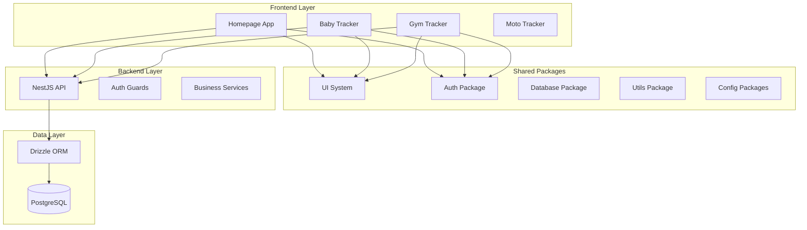

# Design Document

## Overview

The personal-assistant-hub is a monorepo that will host multiple personal productivity tools with a
modular and scalable architecture. The design focuses on code reusability, development consistency,
and the ability to separate individual tools in the future.

## Architecture

### High-Level Architecture



### Monorepo Structure

```
personal-assistant-hub/
├── apps/
│   ├── homepage/                 # Main dashboard app
│   ├── api/                     # NestJS backend
│   └── [future-tools]/          # Baby tracker, gym tracker, etc.
├── packages/
│   ├── ui/                      # Design system + Storybook
│   ├── auth/                    # Authentication logic
│   ├── database/                # Drizzle schemas + migrations
│   ├── utils/                   # Shared utilities
│   ├── eslint-config/           # ESLint configuration
│   ├── typescript-config/       # TypeScript configuration
│   └── i18n/                    # Internationalization resources
├── turbo.json                   # Turborepo configuration
└── package.json                 # Root package.json
```

## Components and Interfaces

### Frontend Architecture

#### Homepage App Structure

```typescript
// apps/homepage/src/
├── components/
│   ├── layout/
│   │   ├── Header.tsx
│   │   ├── Sidebar.tsx
│   │   └── Layout.tsx
│   ├── dashboard/
│   │   ├── DashboardGrid.tsx
│   │   └── ToolCard.tsx
│   └── auth/
│       ├── LoginForm.tsx
│       └── PasskeyAuth.tsx
├── pages/
│   ├── Dashboard.tsx
│   ├── Profile.tsx
│   └── Admin.tsx
├── hooks/
│   ├── useAuth.ts
│   └── useI18n.ts
├── store/
│   └── authStore.ts
└── App.tsx
```

#### Routing Strategy

```typescript
// React Router configuration
const router = createBrowserRouter([
  {
    path: "/",
    element: <Layout />,
    children: [
      { path: "/", element: <Dashboard /> },
      { path: "/profile", element: <Profile /> },
      { path: "/admin", element: <Admin /> },
      // Tool routes will be dynamically loaded
      { path: "/baby-tracker/*", element: <BabyTrackerApp /> },
      { path: "/gym-tracker/*", element: <GymTrackerApp /> },
    ]
  }
]);
```

### Backend Architecture

#### NestJS Module Structure

```typescript
// apps/api/src/
├── modules/
│   ├── auth/
│   │   ├── auth.controller.ts
│   │   ├── auth.service.ts
│   │   ├── auth.module.ts
│   │   └── guards/
│   │       ├── jwt-auth.guard.ts
│   │       └── roles.guard.ts
│   ├── users/
│   │   ├── users.controller.ts
│   │   ├── users.service.ts
│   │   └── users.module.ts
│   └── invitations/
│       ├── invitations.controller.ts
│       ├── invitations.service.ts
│       └── invitations.module.ts
├── common/
│   ├── decorators/
│   ├── filters/
│   └── interceptors/
└── main.ts
```

### Shared Packages Design

#### ESLint Configuration Package

```typescript
// packages/eslint-config/index.js
module.exports = {
  extends: ['@typescript-eslint/recommended', 'prettier'],
  plugins: ['@typescript-eslint', 'import'],
  rules: {
    // Import order enforcement
    'import/order': [
      'error',
      {
        groups: ['builtin', 'external', 'internal', 'parent', 'sibling', 'index'],
        'newlines-between': 'always',
        alphabetize: {
          order: 'asc',
          caseInsensitive: true,
        },
      },
    ],
    // Enforce named exports
    'import/prefer-default-export': 'off',
    'import/no-default-export': 'error',
    // Absolute imports
    'import/no-relative-packages': 'error',
  },
  settings: {
    'import/resolver': {
      typescript: {
        alwaysTryTypes: true,
        project: './tsconfig.json',
      },
    },
  },
};
```

#### UI Package Structure

```typescript
// packages/ui/src/
├── components/
│   ├── Button/
│   │   ├── Button.tsx
│   │   ├── Button.module.css
│   │   └── Button.stories.tsx
│   ├── Input/
│   ├── Modal/
│   └── index.ts
├── tokens/
│   ├── colors.css
│   ├── typography.css
│   └── spacing.css
└── styles/
    ├── globals.css
    └── reset.css
```

#### Auth Package Interface

```typescript
// packages/auth/src/
export interface BaseAuthService {
  login(credentials: any): Promise<AuthResult>;
  logout(): Promise<void>;
  register(data: any): Promise<AuthResult>;
  getCurrentUser(): Promise<User | null>;
  refreshToken(): Promise<string>;
}

export interface PasswordAuthService extends BaseAuthService {
  login(credentials: PasswordCredentials): Promise<AuthResult>;
  register(data: PasswordRegistrationData): Promise<AuthResult>;
  changePassword(oldPassword: string, newPassword: string): Promise<void>;
}

export interface PasskeyAuthService extends BaseAuthService {
  login(credentials: PasskeyCredentials): Promise<AuthResult>;
  register(data: PasskeyRegistrationData): Promise<AuthResult>;
  getAvailableCredentials(): Promise<PasskeyCredential[]>;
}

export interface AuthServices {
  passwordService: PasswordAuthService;
  passkeyService: PasskeyAuthService;
  getCurrentUser(): Promise<User | null>;
  logout(): Promise<void>;
}

export interface User {
  id: string;
  email: string;
  role: 'admin' | 'user';
  createdAt: Date;
  lastLoginAt: Date;
  hasPassword: boolean;
  hasPasskeys: boolean;
}
```

## Data Models

### Database Schema Design

#### Core Tables

```sql
-- Users table
CREATE TABLE hub_users (
  id UUID PRIMARY KEY DEFAULT gen_random_uuid(),
  email VARCHAR(255) UNIQUE NOT NULL,
  role VARCHAR(50) NOT NULL DEFAULT 'user',
  created_at TIMESTAMP DEFAULT NOW(),
  updated_at TIMESTAMP DEFAULT NOW(),
  last_login_at TIMESTAMP
);

-- Password credentials
CREATE TABLE hub_password_credentials (
  id UUID PRIMARY KEY DEFAULT gen_random_uuid(),
  user_id UUID REFERENCES hub_users(id) ON DELETE CASCADE,
  password_hash TEXT NOT NULL,
  salt TEXT NOT NULL,
  created_at TIMESTAMP DEFAULT NOW(),
  updated_at TIMESTAMP DEFAULT NOW()
);

-- Passkey credentials
CREATE TABLE hub_passkey_credentials (
  id UUID PRIMARY KEY DEFAULT gen_random_uuid(),
  user_id UUID REFERENCES hub_users(id) ON DELETE CASCADE,
  credential_id TEXT UNIQUE NOT NULL,
  public_key TEXT NOT NULL,
  counter BIGINT DEFAULT 0,
  device_name VARCHAR(255),
  created_at TIMESTAMP DEFAULT NOW()
);

-- Invitation tokens
CREATE TABLE hub_invitation_tokens (
  id UUID PRIMARY KEY DEFAULT gen_random_uuid(),
  token VARCHAR(255) UNIQUE NOT NULL,
  email VARCHAR(255) NOT NULL,
  created_by UUID REFERENCES hub_users(id),
  expires_at TIMESTAMP NOT NULL,
  used_at TIMESTAMP,
  created_at TIMESTAMP DEFAULT NOW()
);

-- User sessions
CREATE TABLE hub_user_sessions (
  id UUID PRIMARY KEY DEFAULT gen_random_uuid(),
  user_id UUID REFERENCES hub_users(id) ON DELETE CASCADE,
  session_token VARCHAR(255) UNIQUE NOT NULL,
  expires_at TIMESTAMP NOT NULL,
  created_at TIMESTAMP DEFAULT NOW()
);
```

#### Drizzle Schema Definition

```typescript
// packages/database/src/schema/users.ts
import { pgTable, uuid, varchar, timestamp, text, bigint } from 'drizzle-orm/pg-core';

export const users = pgTable('hub_users', {
  id: uuid('id').primaryKey().defaultRandom(),
  email: varchar('email', { length: 255 }).unique().notNull(),
  role: varchar('role', { length: 50 }).notNull().default('user'),
  createdAt: timestamp('created_at').defaultNow(),
  updatedAt: timestamp('updated_at').defaultNow(),
  lastLoginAt: timestamp('last_login_at'),
});

export const passkeyCredentials = pgTable('hub_passkey_credentials', {
  id: uuid('id').primaryKey().defaultRandom(),
  userId: uuid('user_id').references(() => users.id, { onDelete: 'cascade' }),
  credentialId: text('credential_id').unique().notNull(),
  publicKey: text('public_key').notNull(),
  counter: bigint('counter', { mode: 'number' }).default(0),
  createdAt: timestamp('created_at').defaultNow(),
});
```

### State Management Design

#### Zustand Store Structure

```typescript
// packages/auth/src/store/authStore.ts
interface AuthState {
  user: User | null;
  isAuthenticated: boolean;
  isLoading: boolean;
  login: (credentials: PasskeyCredentials) => Promise<void>;
  logout: () => Promise<void>;
  checkAuth: () => Promise<void>;
}

export const useAuthStore = create<AuthState>((set, get) => ({
  user: null,
  isAuthenticated: false,
  isLoading: true,

  login: async credentials => {
    set({ isLoading: true });
    try {
      const result = await authService.login(credentials);
      set({ user: result.user, isAuthenticated: true, isLoading: false });
    } catch (error) {
      set({ isLoading: false });
      throw error;
    }
  },

  logout: async () => {
    await authService.logout();
    set({ user: null, isAuthenticated: false, isLoading: false });
  },

  checkAuth: async () => {
    try {
      const user = await authService.getCurrentUser();
      set({ user, isAuthenticated: !!user, isLoading: false });
    } catch {
      set({ user: null, isAuthenticated: false, isLoading: false });
    }
  },
}));
```

## Error Handling

### Frontend Error Boundaries

```typescript
// Error boundary for each tool/app section
class ToolErrorBoundary extends Component<Props, State> {
  constructor(props: Props) {
    super(props);
    this.state = { hasError: false, error: null };
  }

  static getDerivedStateFromError(error: Error): State {
    return { hasError: true, error };
  }

  componentDidCatch(error: Error, errorInfo: ErrorInfo) {
    console.error('Tool Error:', error, errorInfo);
    // Send to error reporting service
  }

  render() {
    if (this.state.hasError) {
      return <ErrorFallback error={this.state.error} />;
    }
    return this.props.children;
  }
}
```

### Backend Error Handling

```typescript
// Global exception filter
@Catch()
export class GlobalExceptionFilter implements ExceptionFilter {
  catch(exception: unknown, host: ArgumentsHost) {
    const ctx = host.switchToHttp();
    const response = ctx.getResponse<Response>();
    const request = ctx.getRequest<Request>();

    let status = HttpStatus.INTERNAL_SERVER_ERROR;
    let message = 'Internal server error';

    if (exception instanceof HttpException) {
      status = exception.getStatus();
      message = exception.message;
    }

    response.status(status).json({
      statusCode: status,
      timestamp: new Date().toISOString(),
      path: request.url,
      message,
    });
  }
}
```

## Testing Strategy

### Frontend Testing Approach

```typescript
// Integration test example
describe('Dashboard Integration', () => {
  test('should render dashboard with tool cards for authenticated user', async () => {
    const mockUser = { id: '1', email: 'test@example.com', role: 'user' };

    render(
      <MemoryRouter initialEntries={['/']}>
        <AuthProvider initialUser={mockUser}>
          <App />
        </AuthProvider>
      </MemoryRouter>
    );

    expect(screen.getByRole('heading', { name: /dashboard/i })).toBeInTheDocument();
    expect(screen.getByText(/baby tracker/i)).toBeInTheDocument();
    expect(screen.getByText(/gym tracker/i)).toBeInTheDocument();
  });

  test('should redirect to login when not authenticated', async () => {
    render(
      <MemoryRouter initialEntries={['/']}>
        <AuthProvider initialUser={null}>
          <App />
        </AuthProvider>
      </MemoryRouter>
    );

    expect(screen.getByRole('button', { name: /login/i })).toBeInTheDocument();
  });
});
```

### Backend Testing Strategy

```typescript
// Service unit test example
describe('AuthService', () => {
  let service: AuthService;
  let mockUserRepository: jest.Mocked<UserRepository>;

  beforeEach(async () => {
    const module = await Test.createTestingModule({
      providers: [AuthService, { provide: UserRepository, useValue: mockUserRepository }],
    }).compile();

    service = module.get<AuthService>(AuthService);
  });

  test('should create user with valid invitation token', async () => {
    const mockToken = 'valid-token';
    const mockUserData = { email: 'test@example.com' };

    mockUserRepository.findInvitationToken.mockResolvedValue({
      id: '1',
      token: mockToken,
      email: mockUserData.email,
      expiresAt: new Date(Date.now() + 86400000), // 24h from now
    });

    const result = await service.registerWithInvitation(mockToken, mockUserData);

    expect(result.user.email).toBe(mockUserData.email);
    expect(mockUserRepository.createUser).toHaveBeenCalledWith(mockUserData);
  });
});
```

## Internationalization Implementation

### i18n Configuration

```typescript
// packages/i18n/src/config.ts
import i18n from 'i18next';
import { initReactI18next } from 'react-i18next';
import Backend from 'i18next-http-backend';
import LanguageDetector from 'i18next-browser-languagedetector';

i18n
  .use(Backend)
  .use(LanguageDetector)
  .use(initReactI18next)
  .init({
    lng: 'en',
    fallbackLng: 'en',
    supportedLngs: ['en', 'es'],

    backend: {
      loadPath: '/locales/{{lng}}/{{ns}}.json',
    },

    detection: {
      order: ['localStorage', 'navigator', 'htmlTag'],
      caches: ['localStorage'],
    },

    interpolation: {
      escapeValue: false,
    },
  });

export default i18n;
```

### Translation File Structure

```json
// packages/i18n/locales/en/common.json
{
  "navigation": {
    "dashboard": "Dashboard",
    "profile": "Profile",
    "admin": "Admin Panel"
  },
  "auth": {
    "login": "Login",
    "logout": "Logout",
    "register": "Register"
  },
  "tools": {
    "babyTracker": "Baby Tracker",
    "gymTracker": "Gym Tracker",
    "motoTracker": "Moto Tracker"
  }
}

// packages/i18n/locales/es/common.json
{
  "navigation": {
    "dashboard": "Panel Principal",
    "profile": "Perfil",
    "admin": "Panel de Administración"
  },
  "auth": {
    "login": "Iniciar Sesión",
    "logout": "Cerrar Sesión",
    "register": "Registrarse"
  },
  "tools": {
    "babyTracker": "Seguimiento del Bebé",
    "gymTracker": "Seguimiento del Gimnasio",
    "motoTracker": "Seguimiento de la Moto"
  }
}
```

## Security and Dependency Management

### Security Guidelines

#### Dependency Management Strategy

- **Minimize Dependencies**: Implement functionality natively when possible to reduce attack surface
- **Fixed Versions**: Always use exact versions (no `^` or `~`) to prevent automatic updates to
  potentially compromised versions
- **Manual Updates**: Dependencies are updated manually after security review of changelogs
- **Security Monitoring**: Regular audits of dependencies for known vulnerabilities
- **Latest version**: Always use the latest version of the dependency
- **Consistency**: When a new dependency is added, check if it's already in use in other packages
  and keep the same version for every app and package.

#### Version Pinning Policy

```json
// ❌ Avoid - allows automatic updates
"dependencies": {
  "package": "^1.2.3"
}

// ✅ Preferred - exact version pinning
"dependencies": {
  "package": "1.2.3"
}
```

#### Native Implementation Priority

- Prefer native JavaScript/TypeScript implementations over external packages
- Use built-in browser APIs and Node.js modules when available
- Only add dependencies for complex functionality that would be error-prone to implement

## Build and Development Configuration

### Turborepo Configuration

```json
// turbo.json
{
  "pipeline": {
    "build": {
      "dependsOn": ["^build"],
      "outputs": ["dist/**", ".next/**", "build/**"]
    },
    "dev": {
      "cache": false,
      "persistent": true
    },
    "lint": {
      "dependsOn": ["^lint"]
    },
    "test": {
      "dependsOn": ["^build"]
    },
    "type-check": {
      "dependsOn": ["^build"]
    }
  }
}
```

### Package Dependencies Strategy

```json
// Root package.json dependencies
{
  "devDependencies": {
    "@changesets/cli": "^2.27.1",
    "prettier": "^3.6.2",
    "turbo": "^2.5.5",
    "typescript": "^5.9.2"
  }
}

// Shared package versions will be managed through workspace protocol
// Example: "ui": "workspace:*"
```

This design provides a solid foundation for the monorepo setup while maintaining flexibility for
future growth and tool separation.
